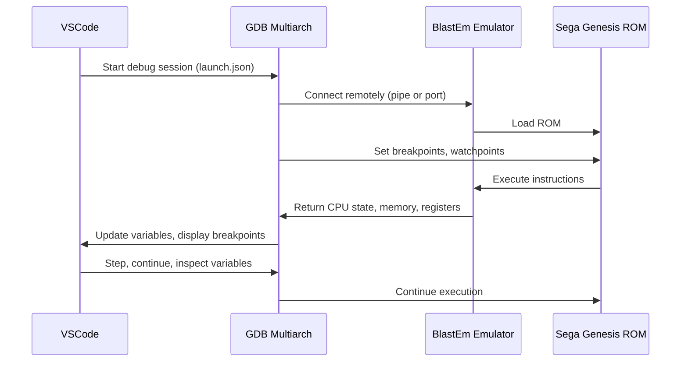

# SGDK Debugging in VSCode

## Requirements
- [Docker](https://www.docker.com/get-started/)
- [WSL](https://learn.microsoft.com/en-us/windows/wsl/install) or any linux distro
- [VSCode](https://code.visualstudio.com/download)
- [C/C++ extension](https://marketplace.visualstudio.com/items?itemName=ms-vscode.cpptools)
- [blastem](https://www.retrodev.com/blastem/) Genesis emulator
